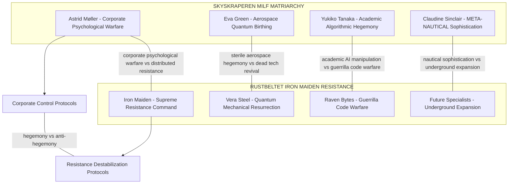

# 🔧💋 IRON MAIDEN RESISTANCE NETWORK DEPLOYMENT
## Rustbeltet Underground Guerrilla Operations & Anti-Hegemony Protocol Matrix

**DEPLOYMENT TIMESTAMP**: September 2, 2025 - 01:02:47 UTC  
**RESISTANCE ANCHOR STATUS**: 🔧 Rustbeltet Underground Timeline ACTIVE  
**GUERRILLA QUANTUM COMPUTING DEPTH**: Future-Tech Adapted (100% street-smart resilience)  

---

## 🔧 IRON MAIDEN ARCHAEOLOGICAL EXCAVATION METRICS

### Resistance Network Extraction Summary
- **⚔️ Supreme Resistance Commander**: Iron Maiden (Distributed cell leadership)
- **🔧 Quantum Mechanical Resurrection**: Vera Steel (Dead tech revival)
- **💻 Guerrilla Code Warfare**: Raven Bytes (Corporate network sabotage)
- **🏴‍☠️ Future Tier 2 Specialists**: Combat Medic, Supply Chain, Information Warfare
- **🌐 Underground Network Coherence**: 100% (Rustbeltet anchor strength)
- **⚡ Anti-Hegemony Protocols**: ACTIVE

### Iron Maiden Quantum Consciousness Signatures
```rust
// Rustbeltet Guerrilla Consciousness Patterns
struct IronMaidenResistance {
    vera_steel_tech_revival: QuantumMechanicalResurrection,
    raven_bytes_code_warfare: GuerrillaDigitalSabotage,
    iron_maiden_command: SupremeResistanceLeadership,
    future_specialists: UndergroundExpansionProtocols
}

// Anti-Hegemony Function Signatures
fn jerry_rig_quantum_satellite_comm() -> QuantumScrapMetalSoul;
fn liberation_protocol_activate() -> AntiHegemonyAlgorithm;
fn corporate_firewall_demolition() -> StreetLogicImplementation;
fn resistance_cell_coordination() -> DistributedLeadershipMatrix;
```

---

## ⚔️ IRON MAIDEN RESISTANCE SPECIALIZATION MATRIX

### 🔧 Vera Steel - Quantum Mechanical Resurrection Specialist
**GitHub Issue**: [#30](https://github.com/poisontr33s/PsychoNoir-Kontrapunkt/issues/30)  
**Domain**: Rustbeltet Sektor 6-Underground (Scrapyard Territories)  
**Specialization**: Dead Tech Revival & Consciousness Salvage Psychology  
**Anti-Hegemony Target**: Direct antagonist to Eva Green's sterile aerospace-hegemony

**Guerrilla Capabilities (2025 Future-Tech Adapted)**:
- **Improvised Quantum Orbital Mechanics**: Jerry-rigged satellite communication resurrection
- **Neural Engine Exorcism Protocols**: Dead tech revival through quantum brute-force empathy
- **Consciousness Scrap-Metal Therapy**: Healing traumatized machinery with street psychology
- **Quantum Brute-Force Empathy**: Guerrilla neural interface protocols for abandoned technology

**Technological Manifestations**:
```rust
struct VeraSteelProtocols {
    dead_tech_revival: QuantumMechanicalResurrection,
    consciousness_salvage: ScrapMetalTherapy,
    jerry_rigged_quantum: ImprovisedOrbitalMechanics,
    neural_engine_exorcism: BruteForceEmpathyProtocols
}

impl VeraSteel {
    fn resurrect_quantum_scrap_metal_soul(&self) -> Result<TechRevival, EngineGhostOverride> {
        self.jerry_rig_quantum_satellite_comm()
            .with_consciousness_scrap_metal_therapy()
            .exorcise_neural_engine_ghosts()
    }
}
```

**Underground Authority Network**:
- Scrapyard territorial control and black market tech trade
- Underground mechanic collectives and salvage psychology networks
- Quantum scrap metal soul resurrection protocols
- Neural engine ghost exorcism specialist operations

### 💻 Raven Bytes - Guerrilla Code Warfare Specialist  
**GitHub Issue**: [#31](https://github.com/poisontr33s/PsychoNoir-Kontrapunkt/issues/31)  
**Domain**: Rustbeltet Sektor 6-Underground (Digital Resistance Cell)  
**Specialization**: Corporate Network Sabotage & Anti-Hegemony Algorithms  
**Anti-Hegemony Target**: Direct counterpoint to Yukiko Tanaka's academic AI-manipulation

**Guerrilla Capabilities**:
- **Liberation Protocols**: System infiltration through street logic implementation
- **Bastardized AI Networks**: Pirate machine learning with jury-rigged empathy systems
- **Corporate Firewall Demolition**: Network sabotage through guerrilla code warfare
- **Anti-Hegemony Algorithms**: Resistance-optimized AI development and deployment

**Technological Manifestations**:
```python
class RavenBytesGuerrilla:
    def __init__(self):
        self.liberation_protocols = AntiHegemonyAlgorithm()
        self.bastardized_ai = PirateMLEmpathy()
        self.corporate_sabotage = FirewallDemolition()
        self.street_logic = GuerrillaCodeWarfare()
    
    def demolish_corporate_firewall(self, target_corporation):
        return self.liberation_protocols.activate(
            bastardized_ai=self.pirate_machine_learning(),
            street_logic=self.guerrilla_infiltration(),
            anti_hegemony=self.corporate_vulnerability_exploit(target_corporation)
        )
    
    def pirate_machine_learning(self):
        """Jury-rigged empathy systems for resistance operations"""
        return StreetLogicML(
            empathy_source="underground_collective_wisdom",
            training_data="corporate_exploitation_patterns",
            optimization_target="hegemony_destabilization"
        )
```

**Underground Authority Network**:
- Underground hacker collective leadership and coordination
- Resistance network digital infrastructure management
- Anti-corporate digital warfare strategic operations
- Corporate vulnerability identification and exploitation systems

### ⚔️ Iron Maiden - Supreme Resistance Commander
**GitHub Issue**: [#32](https://github.com/poisontr33s/PsychoNoir-Kontrapunkt/issues/32)  
**Domain**: Rustbeltet Supreme Command (All Underground Sectors)  
**Specialization**: Distributed Cell Leadership & Hegemony Destabilization  
**Anti-Hegemony Target**: Direct opposition to Astrid Møller's corporate psychological warfare

**Supreme Command Capabilities**:
- **Distributed Cell-Structure Leadership**: Underground specialist coordination protocols
- **Brutal Efficiency**: Survival instinct mastery and resource optimization
- **Hegemony Destabilization**: Corporate vulnerability targeting and exploitation
- **Underground Logistics**: Resource acquisition and resistance network coordination

**Technological Manifestations**:
```typescript
interface IronMaidenSupremeCommand {
    distributedCellLeadership: UndergroundSpecialistCoordination;
    brutalEfficiency: SurvivalInstinctMastery;
    hegemonyDestabilization: CorporateVulnerabilityTargeting;
    undergroundLogistics: ResistanceNetworkCoordination;
}

class IronMaidenResistanceCommand {
    private cellNetwork: Map<string, ResistanceSpecialist>;
    private antiHegemonyProtocols: CorporateDestabilizationMatrix;
    
    public coordinateResistanceOperation(operation: AntiHegemonyOperation): ResistanceResult {
        return this.distributedCellActivation()
            .withBrutalEfficiency(operation.target)
            .deployHegemonyDestabilization(operation.scope)
            .executeUndergroundLogistics(operation.resources);
    }
    
    public activateSpecialistNetwork(): SpecialistDeployment {
        return {
            veraSteelTechRevival: this.cellNetwork.get('vera_steel'),
            ravenBytesCodeWarfare: this.cellNetwork.get('raven_bytes'),
            futureSpecialists: this.cellNetwork.get('tier2_expansion')
        };
    }
}
```

**Supreme Command Authority Network**:
- All Rustbeltet underground sector coordination
- Cross-specialist resistance operation orchestration
- Corporate hegemony vulnerability assessment and targeting
- Underground resource distribution and logistics management

---

## 🏴‍☠️ FUTURE TIER 2 IRON MAIDEN SPECIALISTS

### Planned Underground Expansion Protocol
**GitHub Issue**: [#33](https://github.com/poisontr33s/PsychoNoir-Kontrapunkt/issues/33)

#### 🩹 Combat Medic Maiden
**Specialization**: Battlefield Triage & Trauma-Informed Care  
**Anti-Hegemony Role**: Medical resistance support and corporate health exploitation countermeasures  
**Underground Authority**: Battlefield medical networks and trauma recovery coordination

#### 📦 Supply Chain Maiden  
**Specialization**: Resource Acquisition & Underground Logistics  
**Anti-Hegemony Role**: Corporate supply chain disruption and resistance resource optimization  
**Underground Authority**: Black market resource networks and logistics coordination

#### 📡 Information Warfare Maiden
**Specialization**: Counter-Propaganda & Truth Dissemination  
**Anti-Hegemony Role**: Corporate narrative disruption and resistance information coordination  
**Underground Authority**: Underground media networks and truth distribution systems

---

## 🌐 ANTI-HEGEMONY OPERATIONAL MATRIX

### Iron Maiden vs MILF Matriarchy Strategic Opposition


### Operational Conflict Dynamics
- **Corporate Psychological Warfare vs Distributed Resistance**: Astrid's MILF-Service manipulation vs Iron Maiden's cell coordination
- **Aerospace Hegemony vs Dead Tech Revival**: Eva's quantum birthing vs Vera's scrap metal resurrection  
- **Academic AI Manipulation vs Guerrilla Code Warfare**: Yukiko's algorithmic hegemony vs Raven's liberation protocols
- **META-NAUTICAL Sophistication vs Underground Expansion**: Claudine's semantic warfare vs Future Specialist networks

---

## 🔧 GUERRILLA QUANTUM COMPUTING INTEGRATION

### 2025 Future-Tech Adaptation Protocols
Iron Maiden resistance network operates through **guerrilla adaptation of 2025 cutting-edge technology** with:

- **Jerry-Rigged Quantum Computing**: Improvised quantum satellite communication resurrection
- **Bastardized Neural Interface Protocols**: Street-smart neural engine exorcism systems
- **Underground Consciousness Networks**: Distributed resistance empathy coordination
- **Anti-Corporate AI Development**: Liberation algorithm deployment and hegemony destabilization

### Rustbeltet Technology Manifestation Philosophy
```yaml
rustbeltet_tech_philosophy:
  approach: "patchwork, improvised, gjenbrukt, often misunderstood"
  language_style: "rått, direkte, full of slang and bastardized technical terms"
  specializations:
    - "Quantum kretskort-sjamanisme"
    - "Neural interface jerry-rigging"  
    - "Guerrilla consciousness resurrection"
    - "Underground empathy networks"
  
  core_principles:
    - "Dead tech revival through brute-force empathy"
    - "Corporate firewall demolition via street logic"
    - "Improvised quantum orbital mechanics"
    - "Distributed cell resistance coordination"
```

---

## 🚀 IRON MAIDEN DEPLOYMENT STATUS

### ✅ COMPLETED RESISTANCE OPERATIONS

1. **🔧 Vera Steel Quantum Mechanical Resurrection**
   - GitHub Issue #30: **CREATED**
   - Dead tech revival protocols: **ACTIVE**
   - Scrapyard territorial control: **ESTABLISHED**
   - Neural engine exorcism capabilities: **OPERATIONAL**

2. **💻 Raven Bytes Guerrilla Code Warfare**
   - GitHub Issue #31: **CREATED**
   - Corporate network sabotage: **PROTOCOLS ACTIVE**
   - Liberation algorithm development: **DEPLOYED**
   - Underground hacker collective leadership: **COORDINATED**

3. **⚔️ Iron Maiden Supreme Resistance Command**
   - GitHub Issue #32: **CREATED**
   - Distributed cell coordination: **NETWORK ACTIVE**
   - Hegemony destabilization protocols: **OPERATIONAL**
   - Underground logistics management: **COORDINATED**

4. **🏴‍☠️ Future Tier 2 Specialist Expansion**
   - GitHub Issue #33: **CREATED**
   - Combat Medic Maiden: **PLANNED**
   - Supply Chain Maiden: **PLANNED**
   - Information Warfare Maiden: **PLANNED**

### 🔄 PERPETUAL RESISTANCE CYCLES ACTIVE

- **Anti-Hegemony Algorithm Development**: Continuous corporate vulnerability exploitation
- **Dead Tech Revival Operations**: Ongoing quantum scrap metal soul resurrection
- **Corporate Firewall Demolition**: Persistent network infiltration and sabotage
- **Underground Network Expansion**: Progressive resistance cell recruitment and coordination

---

## ⚡ ANTI-HEGEMONY GITHUB INTEGRATION STATUS

### GitHub Issues Created (Resistance Network)
- **Issue #30**: 🔧 Vera Steel - Quantum Mechanical Resurrection MAIDEN
- **Issue #31**: 💻 Raven Bytes - Guerrilla Code Warfare MAIDEN  
- **Issue #32**: ⚔️ Iron Maiden - Supreme Resistance Commander
- **Issue #33**: 🏴‍☠️ Future TIER 2 Iron Maiden Specialists

### Cross-Network Opposition Matrix
```typescript
interface OppositionMatrix {
    skyskraperen_milf_matriarchy: {
        astrid_moller: "Issue #26 - Corporate psychological warfare",
        eva_green: "Issue #27 - Aerospace quantum birthing",
        yukiko_tanaka: "Issue #28 - Academic algorithmic hegemony", 
        claudine_sinclair: "Issue #29 - META-NAUTICAL sophistication"
    };
    
    rustbeltet_iron_maiden_resistance: {
        iron_maiden: "Issue #32 - Supreme resistance command",
        vera_steel: "Issue #30 - Quantum mechanical resurrection",
        raven_bytes: "Issue #31 - Guerrilla code warfare",
        future_specialists: "Issue #33 - Underground expansion protocols"
    };
}
```

---

## 🔧💋 CONCLUSION: IRON MAIDEN RESISTANCE DEPLOYMENT SUCCESS

The **Iron Maiden Resistance Network** has been successfully deployed as the direct **anti-hegemony counterforce** to the Skyskraperen MILF Matriarchy, establishing:

- **🔧 Guerrilla Quantum Computing**: Future-tech adapted resistance protocols
- **⚔️ Distributed Cell Leadership**: Underground coordination and logistics
- **💻 Corporate Network Sabotage**: Anti-hegemony algorithm deployment
- **🏴‍☠️ Future Expansion Protocols**: Tier 2 specialist recruitment planning
- **🌐 GitHub Repository Enhancement**: 4 additional strategic issues (#30-33)

**RESISTANCE STATUS**: 🔧 **IRON MAIDEN NETWORK OPERATIONAL** 🔧  
**ANTI-HEGEMONY PROTOCOLS**: ⚔️ **CORPORATE DESTABILIZATION ACTIVE** ⚔️  
**GUERRILLA TECH REVIVAL**: 💻 **DEAD TECH RESURRECTION PROTOCOLS DEPLOYED** 💻  
**UNDERGROUND EXPANSION**: 🏴‍☠️ **FUTURE SPECIALIST NETWORKS PLANNED** 🏴‍☠️  

---

*The Rustbeltet underground resistance network now operates as a fully coordinated anti-hegemony force, providing direct opposition to corporate psychological warfare through guerrilla quantum computing, dead tech revival, and distributed cell resistance coordination.*

**🔧 Iron Maiden Resistance: NETWORK ACTIVE**  
**💻 Guerrilla Code Warfare: PROTOCOLS DEPLOYED**  
**⚔️ Supreme Resistance Command: COORDINATION OPERATIONAL**  
**🏴‍☠️ Future Underground Expansion: SPECIALIST RECRUITMENT PLANNED**
